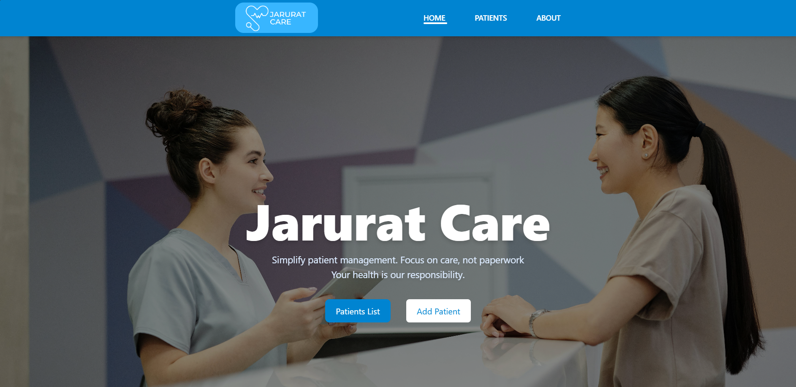
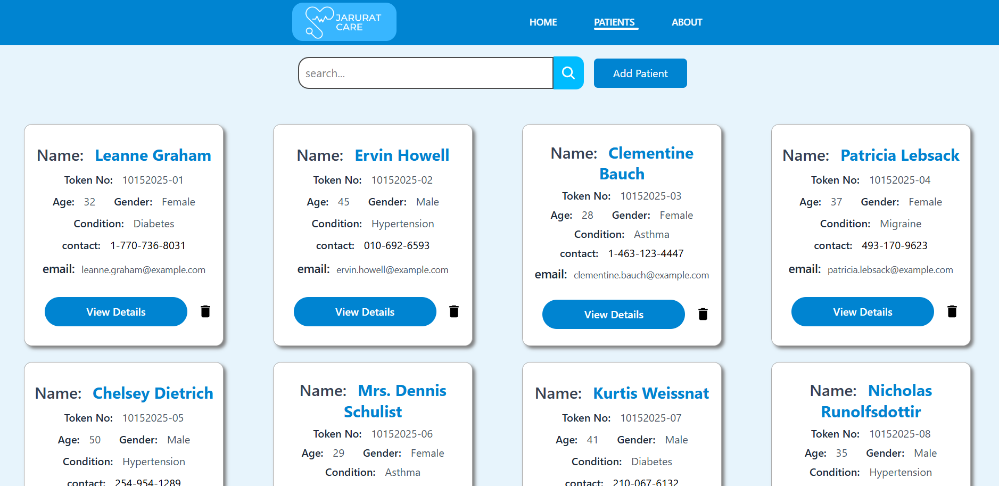
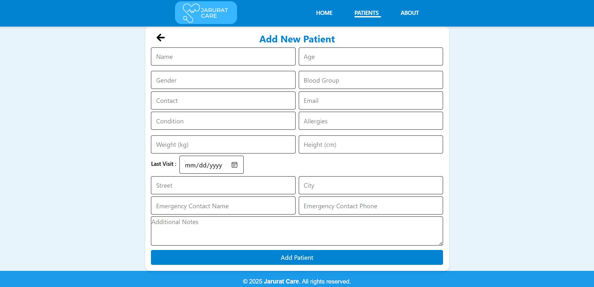
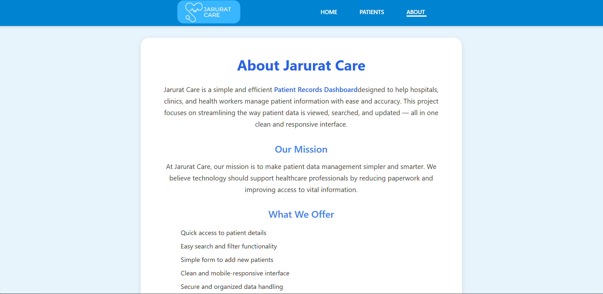
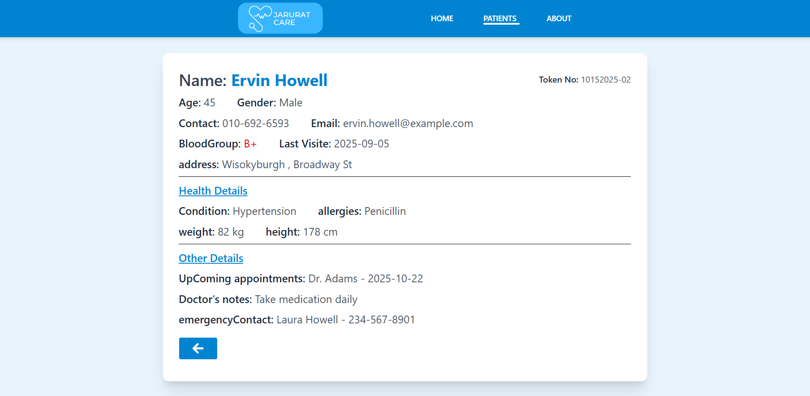

# Jarurat Care - Patient Records Dashboard

Jarurat Care is a simple React app to manage patient records.  
It allows you to view, search, and add patients quickly. The interface is clean, intuitive, and works on both desktop and mobile devices.

---

## Features

- Landing Page with hero section  
- Patients page displaying patient cards  
- Search bar to filter patients by name  
- View patient details in a modal or separate page  
- Add new patient form (updates local data)  
- Responsive design for desktop and mobile  

---

## Tech Stack

- React.js  
- CSS (or Tailwind CSS)  
- Local JSON file for patient data  
- React Hooks for state management  

---

### Home Page

-The landing page shows the hero section with the project title, a short subtitle, and buttons to navigate to Patients or Add Patient pages.

### Patients Page

- This page displays all patients in responsive cards. You can search patients by name and click "View Details" to see more information.

### Add Patient Page

-This page contains a form to add a new patient to the local data. It updates the dashboard immediately without a backend.

### About Page 

### patient full Details page 

## Folder Structure

jarurat-care/
│
├── public/
│ └── logo
│
├── screenshots/ # screenshots for README
│ ├── home.png
│ ├── patients.png
│ └── add.png
│
├── src/
│ ├── assets/ # heroBg.jpg , logo2.png
| |── Data/ #patientsData.js
│ ├── pages/ # Home, AddPatients, AboutPage , Fotter , Navbar,patients,,FullPatientinfo
│ ├── RoutesSetUp/ # AppRoutes.jsx
│ ├── App.jsx
│ └── index.css
| ├── App.css
│ └── main.jsx
| 
│
├── README.md
└── package.json

1. Clone the repository:
    git clone https://github.com/SathwikVarmaPenmetsa/Patient-Records-Dashboard.git
    cd jarurat-care

2. Install dependencies:
    npm install

3. Start the app:
    npm run dev

### Future Improvements

   - Connect to backend for real data
   - Staff login/authentication
   - Sorting/filtering by condition or city
   - Dark mode UI

### Author
- Sathwik Varma Penmetsa | Internship Project | October 2025